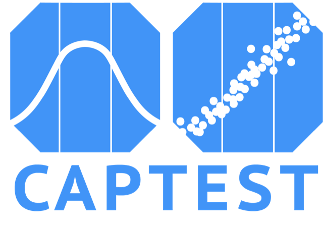

==========================================

Captest is intended to facilitate capacity testing following ASTM E2848.
The captest module contains a single class, CapData, which provides
methods for loading, visualizing, filtering, and regressing capacity
testing data. The module also includes functions that take CapData
objects as arguments and provide summary data and capacity test results.

You can download the `presentation <https://pvpmc.sandia.gov/download/7353/>`_ introducing pvcaptest at the PVPMC modeling workshop this past May.

Please see the :ref:`installation` page for installation help.

There is a live example linked to on the `github page <https://github.com/pvcaptest/pvcaptest>`_.  If you click on the launch binder icon next to "Live Example", you can use an example without installing anything.  Give it a try!

There are exapmles of a few core features in Jupyter notebooks in the `examples directory <https://github.com/pvcaptest/pvcaptest/tree/master/examples>`_.

I am starting work on adding new features with an eye toward a stable, full-featured version 1.0 release.  If you have ideas for features or find bugs, let me know.  I am happy to answer questions or even better open a new issues on the github page.

This project is heavily dependent on the many excellent packages.  Thank you to everyone involved in developing and maintaining the python data science ecosystem, particularly the pandas, statsmodels, bokeh, holoviews, and pvlib packages!

============================================

Contents
========

.. toctree::
   :maxdepth: 2

   installation
   examples
   changelog
   release

Indices and tables
==================

* :ref:`genindex`
* :ref:`modindex`
* :ref:`search`
