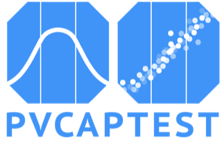

==========================================

pvcaptest is intended to facilitate performing capacity tests that generally follow
ASTM E2848 - Standard Test Method for Reporting Photovoltaic Non-Concentrator System Performance.
The pvcaptest package provides methods for loading, visualizing, filtering, regressing capacity
testing data, and summarizing test results. 

Please see the :ref:`installation` page for installation help.

The :doc:`examples` section provides short examples of how to run a standard and bifacial test and
a long example that explains in detail the functionality pvcaptest provides.
The examples are all produced from Jupyter notebooks
and an interactive version can be launched by clicking on the 'launch binder' button.

This project is under development with a goal of releasing a v1.0 with a stable API.
Please see the `github page <https://github.com/pvcaptest/pvcaptest>`_ for the
source code. Ongoing work is tracked in the Github projects and issues.  If you
have suggestions for improvements or find any bugs, please open an issue.

============================================

Contents
========

.. toctree::
   :maxdepth: 1

   installation
   user_guide/index
   examples
   source/api_reference/index
   changelog
   release
