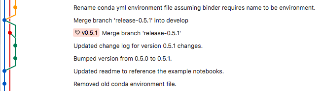

.. _release:

Development Processes and Tools
===============================

Versioning
----------

captest follows `semantic versioning <https://semver.org/>`__.

captest uses `Versioneer <https://github.com/warner/python-versioneer>`__ to set the version from git tags on upstream master.

Git Workflow
------------

The captest project follows the git workflow / branching strategy as described by the following bullets.

- There is a single master branch from which feature branches originate.
- There are no development or release branches.
- Version tags are used to initiate testing and releases to pypi. So, any commit not tagged on master or any other branch is part of development.
- Releases should be made from an upstream repository under an organization account.
- Development work should occur on feature branch on a fork of the upstream organization repository under the contributor's github profile.

This approach is based on the strategy described by Mark Mikofski in his blog post, `Winning Workflow <https://poquitopicante.blogspot.com/2016/10/winning-workflow.html>`__.

Testing
-------

`Travis CI <https://travis-ci.org/>`__ is used for continuous integration testing.  All pull requests are built and tested and version tags on upstream master are built and tested and then, if passing, released to PyPI.

Release Checklist
-----------------

**These steps may change as this process is implemented and tested.**

- Pull from upstream master to update your local clone of your fork
- Push to origin master to keep your local clone up up to date
- Checkout new feature branch
- Create test and pull request
- Update change log
- Complete changes in branch and ensure pull request passes test

Maintainer will:

- checkout master branch
- merge release branch into master
- tag master branch (this will trigger versioneer to update version)
- push updates and tag to github (this will trigger Travis CI to create new build and upload to pypi)
- delete the release branch

History
-------

Versioneer and Travis CI were implemented following v0.5.3.  At the same time the git branching strategy was changed and the captest repository was moved to a pvcaptest organization account.  This section documents issues encountered during this process and how they were resolved.  See the `<= v0.5.3`_ section for details on the previous methods for branching, versioning, and releasing.

Versioneer does not work with the branching strategy described by Vincent Driessen in his post `A successful Git branching model <https://nvie.com/posts/a-successful-git-branching-model/>`__, which is what I had used as the basis for working with git on the captest package.

The issue is that the use of the release branch isolates version tags on the master branch - future commits on develop or a branch that was started from develop are not descendents of the tag.  The screenshot from Sourcetree shows how this happened with the v0.5.1 tag.

Because the project was following Vincent's branching strategy, we can tell that the green line and commits were on the release-0.5.1 branch, which was merged into master (red line) and develop (blue line).  The red line will continues up to the the next tagged release- v0.5.2.  But there is no line of succession from future commits on develop or branches for new features started from develop back to the tag on master.  This means that when working on new features versioneer will give the incorrect version.  For captest, it traces master all the way back to the v0.1.2 tag, which must have been tagged around the time the project originally adopted Vincent's branching strategy.

This would be unacceptably confusing using versioneer moving forward as the version number provided in development branches would not match the underlying code. The last version tag must somehow be an ancestor to ongoing work unless the current work is on a feature that branched off **master/develop** prior to the last tag and **master/develop** has not been merged back in.  The branching strategy described in the `Git Workflow`_ section resolved this issue.

To enact the new Git workflow and branching strategy I deleted all the inactive branches and then merged the develop branch and the latest branch used to install versioneer into master.  I then transferred the pvcaptest repository ownership from my github profile to a new pvcaptest organization account on github and followed Mark's steps to fork and clone pvcaptest for development.

<= v0.5.3
~~~~~~~~~

For v0.5.3 and earlier all versioning and release steps were completed manually using git, github, twine, and pypi following the git branching structure outlined by `Vincent Driessen <https://nvie.com/posts/a-successful-git-branching-model/>`__ and the release process outlined by `Hynek Schlawack <https://hynek.me/articles/sharing-your-labor-of-love-pypi-quick-and-dirty/>`__.

The following points outline the previous release process.

- create a release branch in git
- manually update the version number by editing _version.py
- update change log
- checkout master branch
- merge release branch into master
- tag master branch
- checkout develop and merge release branch into develop branch
- delete the release branch
- push updates and tag to github
- build master branch `python setup.py sdist bdist_wheel`
- use existing test conda environment(s) to test if new build will install from local files and check version number
- delete captest from the test conda environment(s)
- if that works, use twine to upload to the pypi test server
- test installation into test environment(s) using copy on pypi test server
- if that works, then upload to live pypi site

**Resources used for original project setup**

- Jeff Knup's blog post `Open Sourcing a Python Package the Right Way <https://jeffknupp.com/blog/2013/08/16/open-sourcing-a-python-project-the-right-way/>`_

- `Standard way to embed version into python package? <https://stackoverflow.com/questions/458550/standard-way-to-embed-version-into-python-package>`_  I found the answer by Zooko to be more helpful than the accepted answer as it gave a guide to actually implementing versioning.

- `pyinstrument <https://github.com/joerick/pyinstrument>`_

- `Conda skeleton tutorial <https://conda.io/docs/user-guide/tutorials/build-pkgs-skeleton.html>`_

- `PyPA Python packaging tutorial <https://packaging.python.org/tutorials/distributing-packages/#pure-python-wheels>`_

- `.pypirc file <https://docs.python.org/3/distutils/packageindex.html#pypirc>`_

- `migrating to pypi <https://packaging.python.org/guides/migrating-to-pypi-org/#uploading>`_

- `Alexander Waldin <http://alexanderwaldin.github.io/packaging-python-project.html>`_, posted 9/5/2015

- `Hynek Schlawack <https://hynek.me/articles/sharing-your-labor-of-love-pypi-quick-and-dirty/>`_, updated 10/23/17

- `Peter Downs <http://peterdowns.com/posts/first-time-with-pypi.html>`_, no date

- `Tom Christie <https://tom-christie.github.io/articles/pypi/>`_
