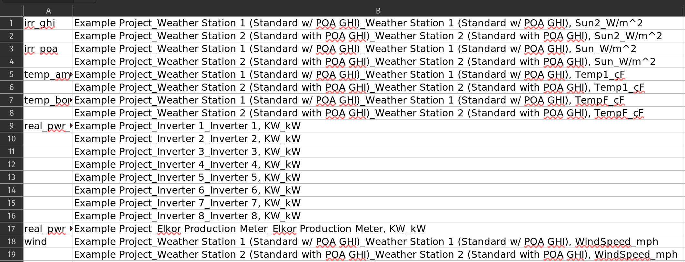
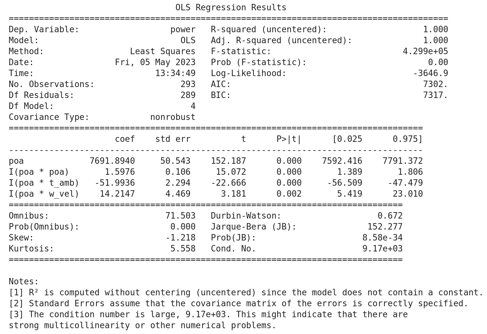
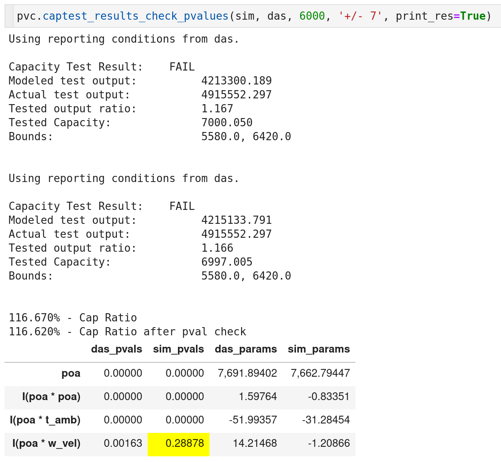

.. _dataload:

Overview
========
The core functionality of pvcaptest is provided by the :py:class:`~captest.capdata.CapData` class, which is a wrapper around two pandas DataFrames, :py:attr:`data` and :py:attr:`data_filtered`. The :py:attr:`data` DataFrame holds the unfiltered data and the :py:attr:`data_filtered` DataFrame is a copy of the data that the :py:class:`~captest.capdata.CapData` filtering methods modify. :py:meth:`~captest.capdata.CapData.reset_filter` can be used to reset the :py:attr:`data_filtered` DataFrame to the unfiltered data. The :py:meth:`~captest.capdata.CapData.fit_regression` method is used to fit the regression equation stored in :py:attr:`regression_formula` to the filtered data. 

Conducting a capacity tests with pvcaptest involves the following steps:

1. Load data from the plant DAS / SCADA system (:py:func:`~captest.io.load_data`) or from a PVsyst file (:py:func:`~captest.io.load_pvsyst`), returning an instance of :py:class:`~captest.capdata.CapData`.
2. Review / modify the :py:attr:`~captest.capdata.CapData.column_groups` attribute as needed.
3. Use the :py:meth:`~captest.capdata.CapData.set_regression_cols` method to set the columns or group of columns to be used in the regression.
4. When there are multiple sensors for a given measurement, use :py:meth:`~captest.capdata.CapData.agg_sensors` to aggregate the data from the sensors.
5. Use the filtering methods to filter the data.
6. Calculate reporting conditions.
7. Use :py:meth:`~captest.capdata.CapData.fit_regression` method to fit the regression equation to the filtered data.
8. Repeat the above steps for the modelled data, except calculating reporting conditions, which should be calculated once from either the measured or simulated data.
9. Compare the regression results for the measured and modelled data.

Loading Measured Data
---------------------
Generally, the first step to conducting a capacity test is to load data from the plant DAS / SCADA system. This is done using :py:func:`~captest.io.load_data`, which will return an instance of the CapData class. This function makes a number of assumptions about the data, which are described below. The data to be loaded should be a single file or a collection of files in single directory.

- The data is in a comma-separated value (CSV) file(s) (other file tye can be used).
- The data is in a "wide" format, with each column representing a different measurement and each row a different time.
- The first column of the data contains date time information that can be parsed by pandas.
- If loading separate files, the files areall csv files.
- If you are loading separate files, the row and column indexes do NOT need to match.

:py:func:`~captest.io.load_data` does a few things in addition to loading the data that are required for functionality of many of the CapData methods like :py:meth:`~captest.capdata.CapData.agg_sensors`, :py:attr:`~captest.capdata.CapData.loc` and :py:attr:`~captest.capdata.CapData.floc`, and the plotting methods and to clean up minor issues in the raw data:

.. note::

    :py:attr:`loc` and :py:attr:`floc` can be used to access data, see `Accessing Filtered and Unfiltered Data`_.

- Sorts the data by the datetime index.
- Drops any rows where all values in the row are duplicates of the any other row.
- Reindexes the data so there are no missing time intervals.
- Attempts to group the columns by measurement type based on the column names and store the resulting groupings in the :py:attr:`column_groups` attribute.
- If you provide information about the project site (latitude, longitude, elevation, timezone, racking type, racking orientation) it will add modeled clear sky POA and GHI irradiance to the :py:attr:`data` DataFrame.

Except for the clear sky modelling, the above describes the default behavior of :py:func:`~captest.io.load_data`, which can be adjusted as needed.

If you are loading data from multiple files and the column headings to match across the files, then :py:func:`~captest.io.load_data` will create attempt to join the data by taking the union of the row and column indexes for all files.

Internally, :py:func:`~captest.io.load_data` uses an instance of the :py:class:`~capdata.io.DataLoader` class, which is available in the :py:attr:`~captest.capdata.CapData.data_loader` attribute of the returned :py:class:`~captest.capdata.CapData` instance. 

.. note::

    Loading data from filetypes other than CSV is possible by passing a custom function to the ``file_reader`` argument of :py:func:`~captest.io.load_data`. Also, the extension needs to be passed as a kwarg, e.g. ``extension='xlsx'``.

.. note::

    If it is necessary to modify the :py:attr:`data` DataFrame to add columns or convert units, it best to do that immediately after loading the data. Followed by calling :py:meth:`~captest.capdata.CapData.reset_filters`, which will overwrite the :py:attr:`data_filtered` DataFrame with the modified :py:attr:`data` DataFrame.

Column grouping
---------------
As mentioned above, much of the functionality of pvcaptest relies on the groupings of the columns of data by measurement type that is stored in :py:attr:`column_groups`, which is an instance of the :py:class:`~captest.columngroups.ColumnGroups` class, but can also be set to a standard python dictionary. :py:attr:`column_groups` maps a label for each group to a list of the column headings that are in each group. 

For example, the first two groups from the Complete Capacity Test example are shown below:

.. code-block:: Python

    CapData.column_groups = {
        'irr_poa_pyran': [
            'met1_poa_pyranometer',
            'met2_poa_pyranometer'
        ],
        'irr_poa_ref_cell': [
            'met1_poa_refcell',
            'met2_poa_refcell'
        ],
    }

The :py:class:`~captest.columngroups.ColumnGroups` class provides some convenient features: nice display of the groupings for review and groups as attributes. Having group id as attributes allows groups of columns to be easily accessed using tab completion in Jupyter notebook.

Due to the very wide range of conventions for naming in DAS / SCADA systems, the default approach to grouping columns often fails to return a satisfactory grouping of the columns. This can be addressed by providing an explicit mapping of column group ids to column names in an external file. To do this the path to the file should be passed to ``group_columns``. Excel, JSON, and YAML files are all options. JSON and Yaml must parse to a python dictionary with keys that are string ids of the groups and values that are lists of column names.

When using an excel file the first column should contain the group ids and the second column should contain all the column headings. The group names do not need to repeated. There should be no header row in the excel file. The most convenient way to create an Excel file specifying the groupings is to run :py:meth:`~captest.io.load_data` twice:

1. Run :py:func:`~captest.io.load_data` with ``column_groups_template`` set to ``True``. This will create an Excel file with the column headings in the second column and save it to the same directory as the data files.
2. Re-order the column headings as necessary and add group ids to the first column.
3. Run :py:func:`~captest.io.load_data` again with ``column_groups_template`` set to ``False`` and ``group_columns`` set to the path to the Excel.

Screenshot of the excel file loaded in the Concise Example Capacity Test showing the format for defining a column grouping in an Excel file:

.. note::

    The column names in the column groups template excel file are sorted alphabetically after reversing the names, so names with the same ending are grouped together. This is often a good starting point for grouping the columns, but it is not always correct, so review carefully!

Identifying Regression Data
---------------------------
To perform the regression pvcaptest uses `statsmodels <https://www.statsmodels.org/stable/index.html>`_, which in turn `relies on patsy <https://www.statsmodels.org/stable/examples/notebooks/generated/formulas.html>`_ to simplify specifying regression equations.

By default the ASTM E2848 regression equation is defined in the :py:attr:`regression_formula` attribute:

.. code-block:: Python

        'power ~ poa + I(poa * poa) + I(poa * t_amb) + I(poa * w_vel) - 1'

Patsy and Statsmodels expect to find columns with the `power`, `poa`, `t_amb`, and `w_vel` headings in the DataFrame passed to fit the regression. Rather than requiring those headings to be in the :py:attr:`data` DataFrame, pvcaptest requires the user to specify which columns or *group of columns* are to be used in the regression in :py:attr:`regression_cols`. The :py:meth:`~captest.capdata.CapData.set_regression_cols` method can used to identify column headings or column group ids (:py:attr:`column_groups` keys). Or :py:attr:`regression_cols` can be set to a dictionary mapping the regression terms defined in the :py:attr:`regression_formula` to the column headings or :py:attr:`column_groups` id.

The ability to map a regression term to a group of columns is useful when there are multiple sensors for a given measurement, as described in the next section.

Aggregating Sensors
-------------------
:py:meth:`~captest.capdata.CapData.agg_sensors` can be used to aggregate data from multiple sensors into a single column. This is useful when there are multiple sensors for a given measurement. Any combination of groups of columns and aggregation functions can be passed. By default the groups of columns assigned to the ``power``, ``poa``, ``t_amb``, and ``w_vel`` keys in the :py:attr:`regression_cols` attribute are aggregated by summing the power and averaging the POA irradiance, ambient temperature, and wind speed columns.

:py:meth:`~captest.capdata.CapData.agg_sensors` adds the resulting aggregated columns to the :py:attr:`data` and :py:attr:`data_filtered` dataframes. If :py:attr:`regression_cols` included a group of columns that was aggregated, :py:attr:`regression_cols` is updated to map the regression term to the aggregated column.

For example, if the :py:attr:`regression_cols` attribute was set to the following:

.. code-block:: Python

    CapData.regression_cols = {
        'power': 'real_pwr_mtr',
        'poa': 'irr_poa',
        't_amb': 'temp_amb',
        'w_vel': 'wind',
    }

Where ``irr_poa``, ``temp_amb``, and ``wind`` are the ids of groups of columns in :py:attr:`column_groups`.

When agg_sensors is called with the default arguments, :py:attr:`regression_cols` is updated to the following:

.. code-block:: Python

    CapData.regression_cols = {
        'power': 'real_pwr_mtr',
        'poa': 'irr_poa_mean_agg',
        't_amb': 'temp_amb_mean_agg',
        'w_vel': 'wind_amb_mean_agg',
    }

where ``irr_poa_mean_agg``, ``temp_amb_mean_agg``, and ``wind_amb_mean_agg`` are the ids of the aggregated columns in :py:attr:`data` and :py:attr:`data_filtered` and these columns will be used when fitting the regression.

Accessing Filtered and Unfiltered Data
--------------------------------------
The methods :py:attr:`loc` and :py:attr:`floc` can be used to access columns of data from the :py:attr:`data` and :py:attr:`data_filtered` DataFrames, respectively.

Any column heading of the :py:attr:`data` DataFrame, group id from :py:attr:`column_groups`, or regression term from :py:attr:`regression_cols` can be passed to :py:attr:`loc` or :py:attr:`floc`. Or, a list with any combination of these identifiers can be passed. 

Filtering
---------
The :py:class:`~captest.capdata.CapData` class provides a variety of methods for filtering as described in ASTM E2848. These methods are all begin with "filter\_" and are well described in the docstrings of each method.

Running filters removes data from :py:attr:`data_filtered`. Each subsequent filtering method called will be applied to :py:attr:`data_filtered`, so the overall filtering is cumulative.

:py:meth:`~captest.capdata.CapData.reset_filter` method can be used to reset the :py:attr:`data_filtered` DataFrame to the unfiltered data.

The :py:meth:`~captest.capdata.CapData.get_summary` method will return a summary dataframe showing the number of rows in the :py:attr:`data_filtered` DataFrame before and after each filter was applied, the name of the each filter, and the arguments passed when calling each filter.

Reporting conditions
--------------------
:py:meth:`~captest.capdata.CapData.rep_cond` can be used to calculate the reporting conditions. The reporting conditions are calculated for columns mapped to the :py:attr:`regression_col` terms ``poa``, ``t_amb``, and ``w_vel`` and are stored in the :py:attr:`rc` attribute.

Currently there is not functionality to calculate reporting conditions for other regression terms for cases where the default regression formula has been changed. But, the reporting conditions can be calculated manually and assigned to the :py:attr:`rc` attribute as a dataframe.

The "Reporting Conditions and Predicted Capacities" example demonstrates the reporting condition functionality in more detail.

Fitting Regressions
-------------------
:py:meth:`~captest.capdata.CapData.fit_regression` is used to fit the regression equation stored in :py:attr:`regression_formula` to the filtered data. The statsmodels `regression results <https://www.statsmodels.org/stable/generated/statsmodels.regression.linear_model.RegressionResults.html#statsmodels.regression.linear_model.RegressionResults>`_ are stored in the :py:attr:`regression_results` attribute.

By default a summary showing the results of the regression is printed, similar to below:

Results
-------
After loading, filtering and regressing measured and simulated data in two separate instances of :py:class:`~captest.capdata.CapData`, the results can be compared using the :py:func:`~captest.capdata.captest_results_check_pvalues`. This will provide a summary of the predicted power using the regression coefficients of each :py:class:`~captest.capdata.CapData` instance and the reporting conditions.

The results function will check and warn for potential issues:

- The regression equations in the two :py:class:`~captest.capdata.CapData` instances are different.
- Both :py:class:`~captest.capdata.CapData` instances have reporting conditions.

See the `Example Capacity Test`_, for example usage of the results function.

.. _Example Capacity Test: ../examples/complete_capacity_test.html

The results from that example display as follows:

By default the results will be calculated twice. The second calculation will set the regression coefficient for any term where the p-value is greater than 0.05 to zero before calculating the predicted power. These high p-values are highlighted in yellow as shown in the above example for the wind speed regression term of the simulated data.

